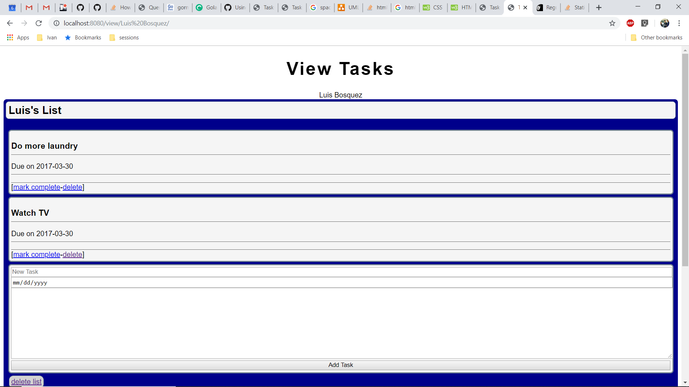
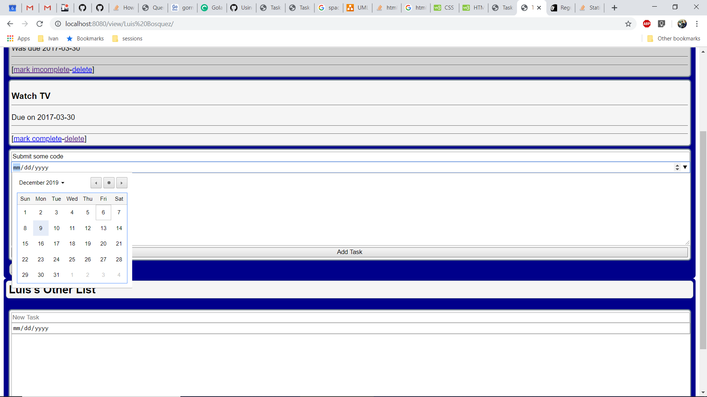

# Creative Project
## Ivan Webber
For my creative project I wanted to highlight Go's utility in networking. Go is mostly used in cloud computing, so I decided to make a RESTful web app for keeping track of To-Do items.

In my code attempted to follow [golang.org's recommendations](https://golang.org/doc/effective_go.html#commentary) for documentation and style. Additionally I made [test cases]("github.com/ivanthewebber/csc372-project/rot13/rot13_tests.go") using Golang's unit-test framework.

In order to learn how to implement each of the components of this application I followed a number of independent tutorials which I highly recomend (below).

| name                        | url                                                |
| --------------------------- | -------------------------------------------------- |
| SQL Server, Windows, Go sql | https://www.microsoft.com/en-us/sql-server/developer-get-started/go/windows |
| Writing Web Applications    | https://golang.org/doc/articles/wiki/ |
| A Tour of Go                | https://tour.golang.org/ |
| Using Templates             | https://blog.gopheracademy.com/advent-2017/using-go-templates/ |


## Model:
My code declares datatypes that are stored as tables on a database.

Connection to the database (and conversions of data) is aided by the gorm package from github.com/jinzhu/gorm. This popular package helps implement an Object-Relational Mapping (ORM) style of database. I stuck to the more traditional database style in my implementation.

Each struct is converted by gorm into a corresponding table in the database. The name of the table is the lower_snake_case plural name of the struct. Each field corresponds to a lower_snake_case column in the table (except the gorm.Model which becomes a number of rows with ID, last edit date, and etc.).
```go
// User is a named owner of lists
type User struct {
	gorm.Model
	FirstName string `gorm:"primary_key"`
	LastName  string `gorm:"primary_key"`
}

// Task is a to-do item
type Task struct {
	gorm.Model
	Title      string `gorm:"primary_key"`
	Details    string
	DueDate    string
	Completed  bool
	TaskListID uint
}

// TaskList is named set of tasks
type TaskList struct {
	gorm.Model
	Title  string `gorm:"primary_key"`
	UserID uint
}
```

## View & Controller
My app provies data to the user via http response and requests (i.e. RESTful application).

The html package provides many methods for serving content, but none of these methods are encrytped. For encryption one is able to change html out for the net package which uses TLS 1.3. Following the extra steps for TLS was beyond the scope of this assignment.

| endpoint                                     | purpose                                 |
| -------------------------------------        | --------------------------------        |
| /welcome                                    | user's first point of contact           |
| /login                                      | finds or lists user in DB               |
| /view/firstname lastname                    | display's user's to-do lists            |
| /add/firstname lastname                     | request to add a list                   |
| /delete/firstname lastname                  | request to delete a list                |
| /add/firstname lastname/list                | request to add task to list             |
| /delete/firstname lastname/list             | request to delete task from list        |
| /mark/firstname lastname/list/task | toggle's the .Completed field of a task |
NOTE: the server will be live at localhost:8080

## RegEx
Most open-source implementations of Regular Expressions (i.e. RegEx or RegExp) tend to be slow (including Python's, I've timed it and looked at the implementation). However, Go's is much faster because it creates a digraph and iteratively searches for matches instead of recursing. [I think it's very interesting.](https://swtch.com/~rsc/regexp/regexp1.html)

It's best to compile each regexp only once, so it's an accepted idiom to have them as global variables (this also allows sharing). Notice that these are naturally constants.

## templates
Golang's template package provides powerful tools for templating text and html.

By execution the template a user-specific page is generated. Consider, for example, my todo list:

```html
.
.
.
<div id="user">Ivan Webber</div>

  <div class="list">
    <h2>Home Work</h2>
    
    <ul>    
      <li class="finished task">
        <h3>Write Code</h3>
        <hr>
        <p>Was due Monday</p>
        <hr>
        <p>These details...</p>
        <hr>
        <ul class="options">
          <li>[<a href="/mark/Ivan%20Webber/Home20%Work/Write20%Code">mark imcomplete</a></li>-
          <li><a href="/edit/Ivan%20Webber/Home20%Work/Write20%Code">edit</a></li>-
          <li><a href="/delete/Ivan%20Webber/Home20%Work/Write20%Code">delete</a>]</li>
        </ul>
      </li>
      
      <li class=" task">
        <h3>My Other Project</h3>
        <hr>
        <p>Due on Wednesday</p>
        <hr>
        <p>Those details...</p>
        <hr>
        <ul class="options">
            <li>[<a href="/mark/Ivan%20Webber/Home20%Work/My20%Other20%Project">mark complete</a></li>-
.
.
.
```

Like the Regular Expressions it's best to only parse the template once.

## Runtime




